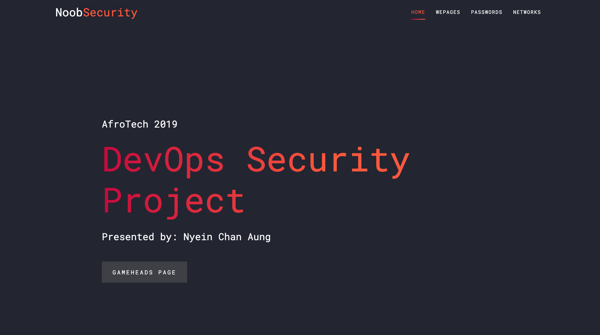
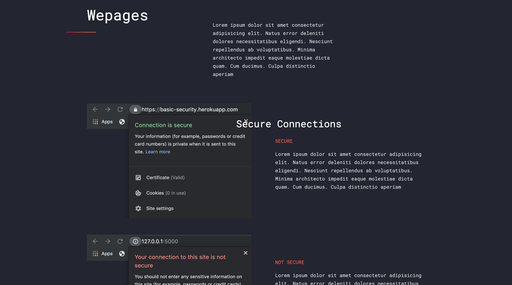

# Web Security Project
Presenting a website on the basics of security and saving yourself from possible attackers

## Content
Overview of the Flask / [Heroku](https://basic-security.herokuapp.com/) Website set up
### Home

Home page linking to Gameheads

### Webpages

### Passwords

### Networks

## How to Run
1. Use [Heroku](https://basic-security.herokuapp.com/)

2. Clone the repo
        export FLASK_ENV=development
        flask run
        [http://127.0.0.1:5000/](http://127.0.0.1:5000/)